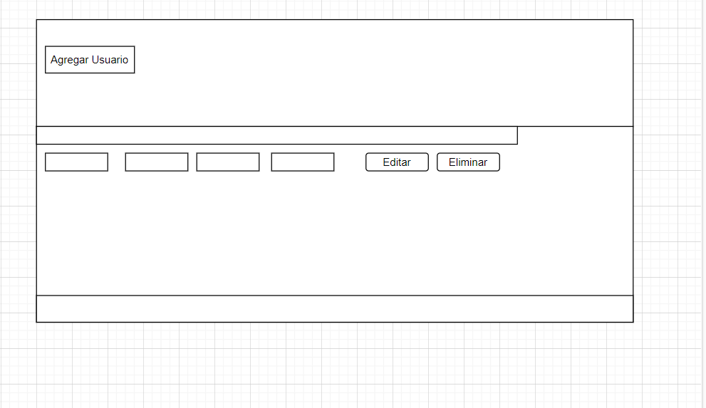

# PROYECTO 2:  Aplicación CRUD
# Daniela Pizar

- Las secciones siguientes:

C - Create ("Crear")
R - Read ("Leer")
U - Update ("Actualizar")
D - Delete ("Borrar")-

-Una aplicación se esta  usando solo una página. 
-Seccion agrega usuarios
-Una sección para borrar Usuarios
-Una sección para modificar informacion de los usuarios
-Una sección para enlista todos los registros agregados

Este Sitio [GitHub Pages proyect CRUD](https://github.com/Danypizar/Proyecto1-CRUD.git).

[Se puede Visualizar en]()

hi
!Este Sitio [GitHub Pages proyect CRUD] ( ).
Este Sitio [Sitio Funcionando](https://cozy-horse-948310.netlify.app/).
